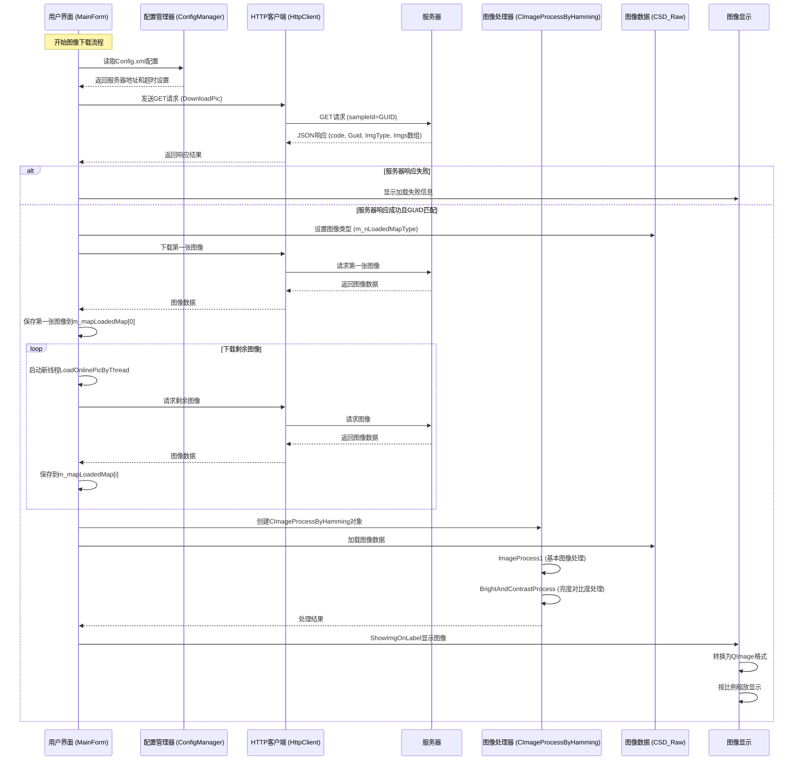

# 图像下载和处理流程UML序列图

## 概述

该文档描述了图像处理平台中从服务器下载图像到最终显示的完整流程。

## UML序列图

## 详细流程说明

### 1. 配置读取阶段
- 系统从Config.xml中读取服务器地址、超时时间等配置信息

### 2. 服务器通信阶段
- 向服务器发送下载请求，参数包括当前的工作GUID
- 解析服务器返回的JSON数据

### 3. 图像下载阶段
- 验证返回的GUID与当前工作GUID是否匹配
- 下载第一张图像并保存到m_mapLoadedMap[0]
- 使用多线程下载其余图像

### 4. 图像处理阶段
- 使用CImageProcessByHamming类进行图像处理
- 执行基本图像处理和亮度对比度处理

### 5. 图像显示阶段
- 将处理后的图像转换为QImage格式
- 按比例缩放以适应显示区域